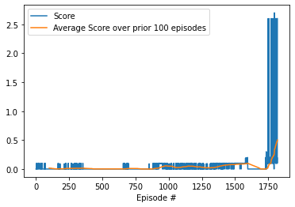
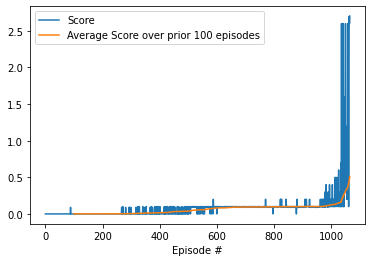

# Project 1: Collaboration and Competition

## Learning Algorithm

### DDPG - No Prioritized experience replay

For this project I trained a Deep Deterministic Policy Gradient (DDPG) agent for an altered version of the Unity Tennis environment. The code for the agent and its models was based on Udacity's "[ddpd-pendulum" example](https://github.com/udacity/deep-reinforcement-learning/tree/master/ddpg-pendulum). 

This agent maintains actor and critic neural networks. The critic network approximates the action value function Q(s, a) and the actor network tries to select the action maximizing that function based on the current state. The agent also maintains target actor and critic networks to compute the next action and Q value to learn from. These networks are soft updated with a weight of TAU after each learning step. 

Both actor and critic networks have two hidden linear layers, with 100 and 50 units in the first and second layers respectively.  The actor network takes the 24 dimensional state and outputs a 2 dimensional action. It has ReLU activations on the first and second layers and a tanh activation on the output. Batch normalization is applied after the ReLUs of the first two layers and to the input state. The critic network likewise has ReLU activations on its hidden layers. It takes the state and action as input, passes the state to the first hidden layer, then concatenates that layer's output with the action as input to the second layer. Batch normalization is performed on the input state and to the output of the first layer (after the ReLU). It has no activation on its output.

The DDPG agent also uses experience replay and selects actions with the addition of Ornstein-Ulenbeck noise as used in the [original DDPG paper](https://arxiv.org/abs/1509.02971) and the provided Udacity code. The noise decays proportionally to the inverse square root of the number of episodes. Another alteration is that the agent only updates its networks after every 4 steps. The best performance, solving the environment with a score of .5 in the set of 100 episodes starting with episode 1720, was achieved using the following set of hyperparameters.

		BUFFER_SIZE = int(1e5)
		BATCH_SIZE = 256
		GAMMA = 0.99
		TAU = 1e-3
		LR_ACTOR = 5e-4
		LR_CRITIC = 6e-3
		UPDATE_EVERY = 4
		UPDATE_ITERATIONS = 1

### DDPG - Prioritized experience replay

I also tried using DDPG with prioritized experience replay (PER). The performance seemed more stable and the environment was solved after only 721 episodes, although in my environment it took a longer time. This algorithm was mostly the same as described above. Aside from the use of PER, I also multiplied the noise by 10 and used the following set of hyperparameters. 

		BUFFER_SIZE = int(2 ** 16)
		BATCH_SIZE = 256
		GAMMA = 0.99
		TAU = 1e-3
		LR_ACTOR = 1e-4
		LR_CRITIC = 1e-3
		UPDATE_EVERY = 4
		UPDATE_ITERATIONS = 4

## Ideas for Future Work

Hyperparameter tuning was not exhaustive, so it may be possible to improve performance with further tuning. I could also try other algorithms, such as Proximal Policy Optimization or MADDPG. Performance also seemed sensitive to the noise used, which warrants further investigation.
